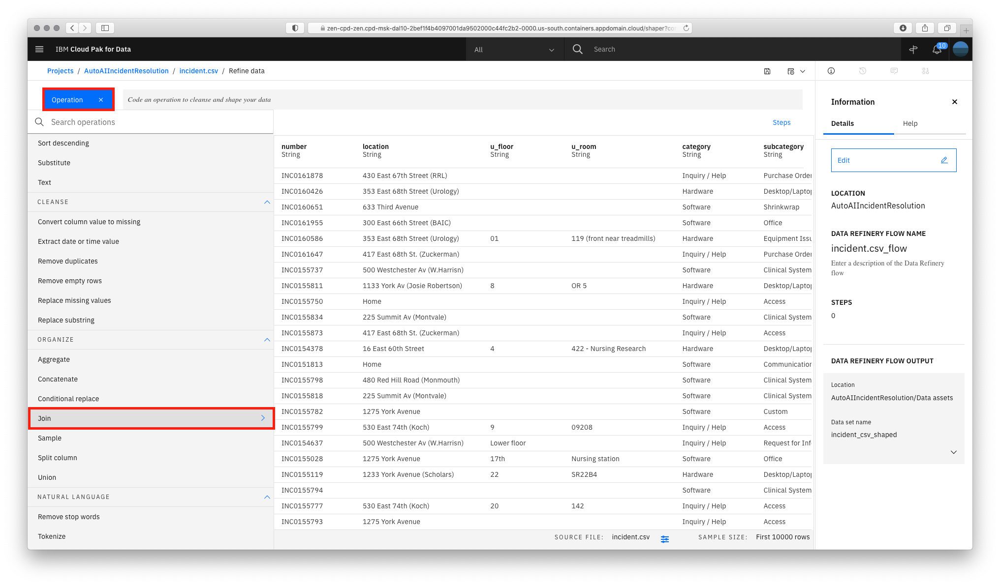
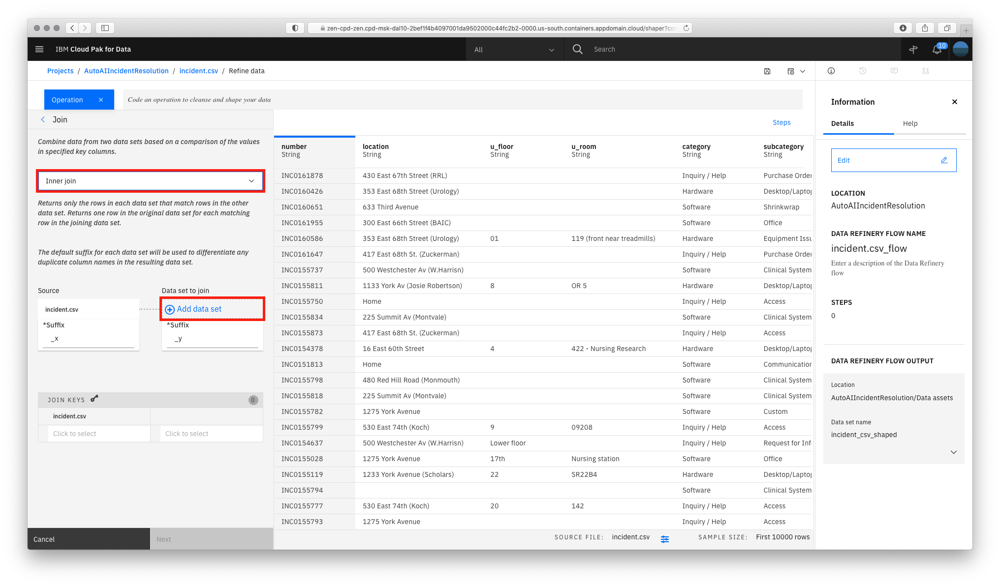
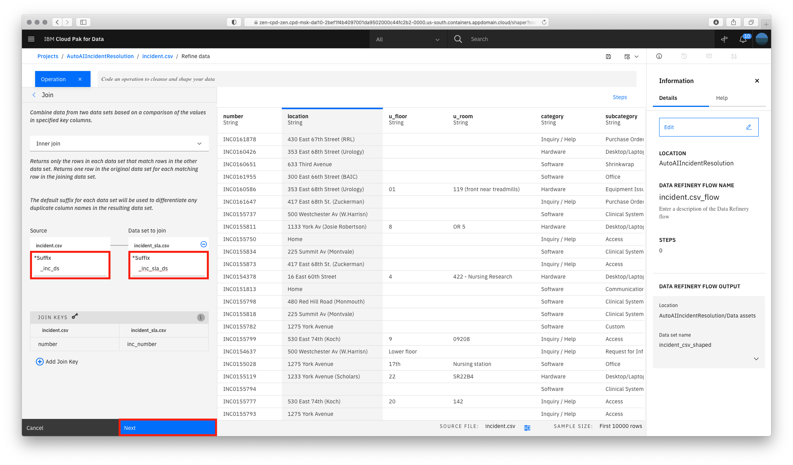
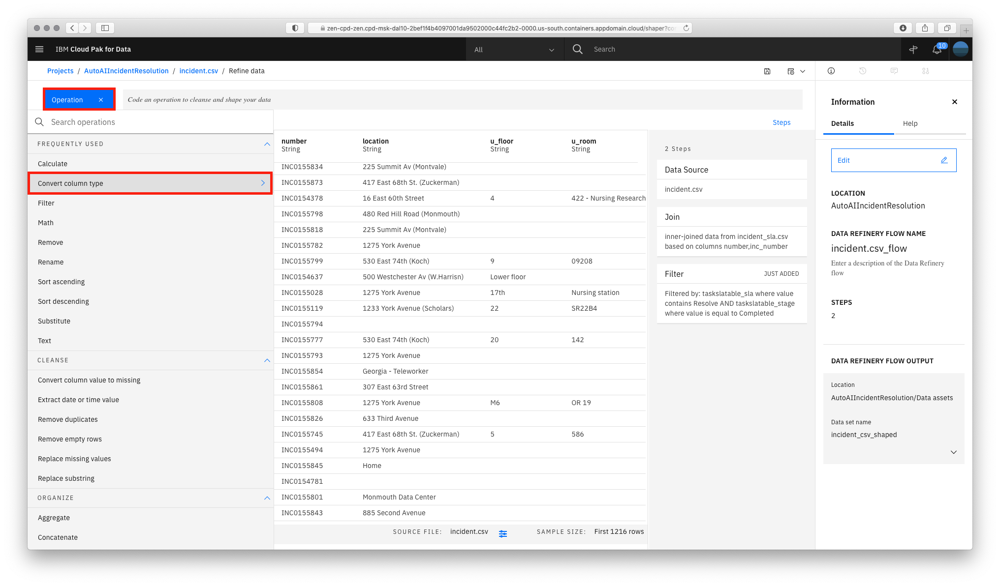
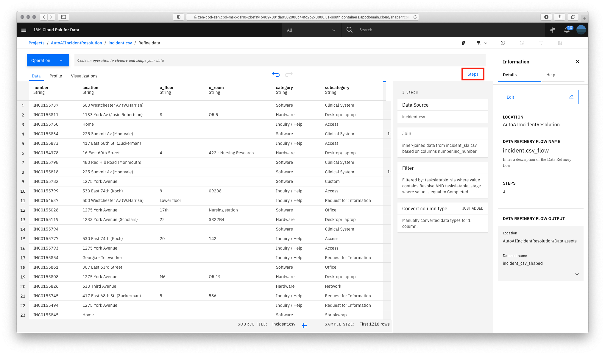
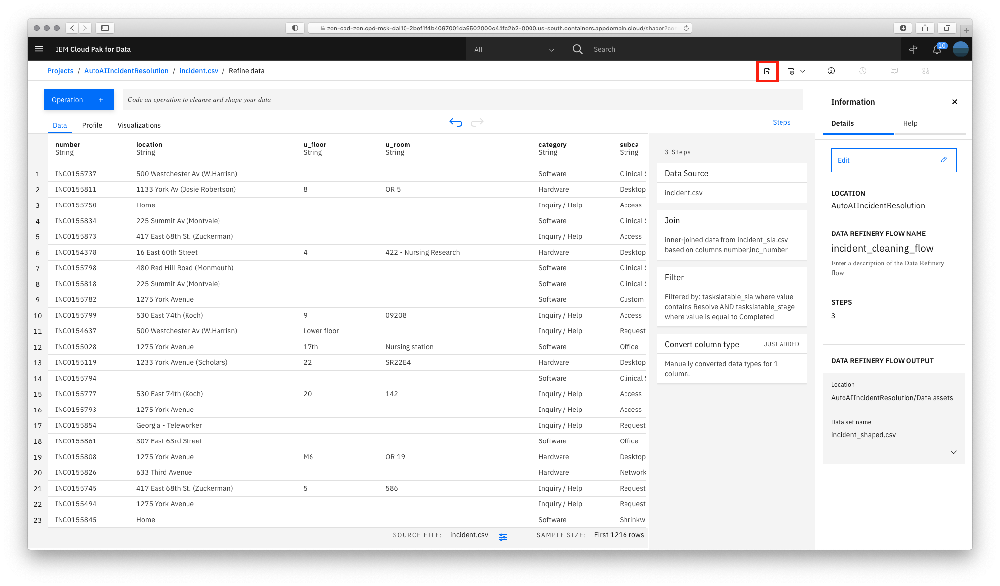
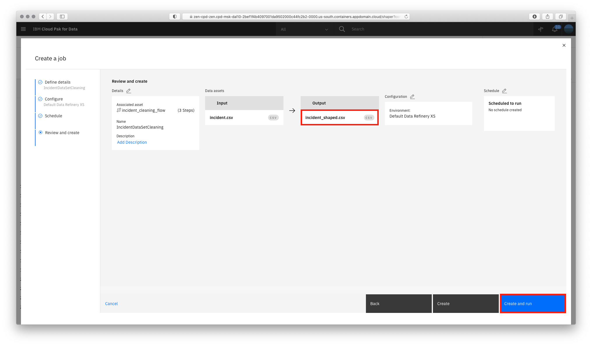
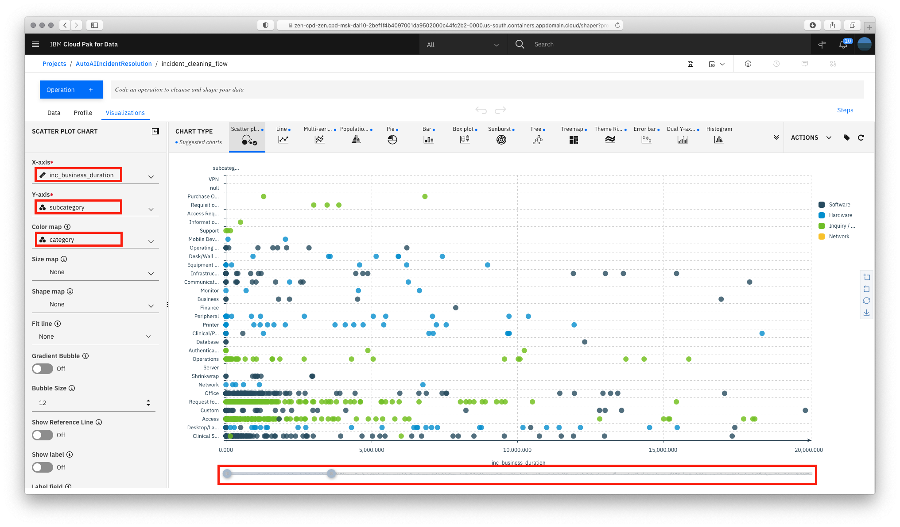

# Data Processing with Data Refinery

In this module, we will prepare our data assets for analysis. We will use the `Data Refinery` graphical flow editor tool to create a set of ordered operations that will cleanse and shape our data. We will also explore the graphical interface to profile data and create visualizations to get a perspective and insights into the dataset.

This section is broken up into the following steps:

1. [Merge and Cleanse Data](#merge-and-cleanse-data)
1. [Profile Data](#profile-data)
1. [Visualize Data](#visualize-data)

> **Note:** You can click on any image in the instructions below to zoom in and see more details. When you do that just click on your browser's back button to return to the previous page.

## Merge and Cleanse Data

We will start by wrangling, shaping and refining our data. To do this, we will create a refinery flow to contain a series of data transformation steps.

* Go the (☰) navigation menu, expand `Projects` and click on the `AutoAIIncidentResolution` project pre-created for this section.

    

* To create a data refinery flow, click the `Add to project` button from the top of the page and click the `Data Refinery flow` option.

    

* Select `Data assets` on the left panel, then select the `incident.csv` data asset. Then click the `Add` button.

    

* The first thing we want to do is create a merged dataset. Start by joining the incident data with information about incident SLA. Click the `Operation +` button on the top left and then scroll down and select the `Join` operation.

    

* From the drop down list, select `Inner join` and then click the `Add data set` link to select the data asset you are going to join with.

    

* Select `Data assets` on the left panel and this time select the `incident_sla.csv` data asset. Then click the `Apply` button.

    

* Finish setting the following values and then click the `Next` button:

    * Under the `Source` `*Suffix` option, enter `_inc_ds`.
    * Under the `Data set to join` `*Suffix` option, enter `_inc_sla_ds`.
    * Under the Join keys, click the input box and select `number` for `incident.csv` and `inc_number` for `incident_sla.csv`.

        

* Although we could modify what columns will be in the joined dataset, we will leave the default and include them all. Click the `Apply` button.

    

* Now we want to filter the rows that will be used for training the model. Click on the `Operation +` button and select `Filter` operation.

    

* Use the condition `CONDITION 1` and
    * Under `Column` select `taskslatable_sla` and for `Operator` select `Contains`. Leaving the `Text` checkbox selected, type **Resolve**.
    * Then add a second condition by clicking on `Add condition +` and leave `AND` selected. This time, under `Column` select `taskslatable_stage` and in `Operator` select `Is equal to` and type **Completed** on the `Value` text input field.
    * Go ahead and click `Apply`.

    

* Finally, for visualization purposes, let's convert the `inc_business_duration` column from `String` to `Integer`. Again, click on `Operation +` button and select `Convert column type`.

    

* Click on `Select column +` and under `Column` select `inc_business_duration`. On `Type` select `Integer` and `Apply`.

    

* At this point, you have a data transformation flow with 3 steps. The flow keeps track of each of the steps and we can even undo (or redo) an action using the circular arrows. To see the steps in the data flow that you have performed, click the `Steps` button. The operations that you have performed on the data will be shown.

    

* You can modify these steps and/or save for future use. Lets edit the flow name and output options. Click on the `Information` icon on the top right and then click the `Edit` button.

    

* Click the pencil icon next to `Data Refinery Flow Name`, set the name to `incident_cleaning_flow` and click the `Apply` button. Then click the `Edit Output pencil icon` and set the name to `incident_shaped.csv` (leave the rest of the CSV output defaults) and click the 'Check mark icon'. Finally, click the `Done` button

    

* Click the `Save` icon to save the flow.

    

### Run Data Flow Job

Data Refinery allows you to run these data flow jobs on demand or at scheduled times. In this way, you can regularly refine new data as it is updated.

* Click on the `Jobs` icon and then `Save and create a job` option from the menu.

    

* Give the job a name and optional description. Click the `Next` button.

    

* Click `Next` on the next two screens, leaving the default selections. You will reach the `Review and create` screen. Note the output name, which is `incident_shaped.csv`. Click the `Create and run` button.

    

* When the job is successfully created, you will receive a notification. Click on the `job details` link in the notification panel to see the job status.

    

* The job will be listed with a status of `Running` and then the status will change to `Completed`. Once its completed, click the project name `AutoAIIncidentResolution`.

    

* Click on the `Assets` and you will find a new CSV file `incident_shaped.csv` in your `Data assets`

    

## Profile Data

* Scroll down to the `Data Refinery flows` section and click on the `incident_cleaning_flow` flow.

    

* Wait for the flow operations to be applied and then click on the `Profile` tab will bring up a view of several statistics and histograms for the attributes in your data.

    

* You can get insight into the data from the views and statistics:

    * The median incident business duration is 289 seconds.
    * TODO: add more insights

## Visualize Data

Let's do some visual exploration of our data using charts and graphs. Note that this is an exploratory phase and we're looking for insights in out data. We can accomplish this in Data Refinery interactively without coding.

* Scatter `category`/`subcategory`

* Histogram `assignment_group`

## Conclusion

We've seen a some of the capabilities of the Data Refinery. We saw how we can transform data, as well as using various operations on the columns such as changing the data type and filtering. We next saw that all the steps in our Data Flow are recorded, so we can remove steps, repeat them, or edit an individual step. We were able to quickly profile the data, to see histograms and statistics for each column. And finally we created more in-depth Visualizations, creating a scatter plot and histogram to explore the relationship between the incident duration and its category, subcategory and assignment group.
