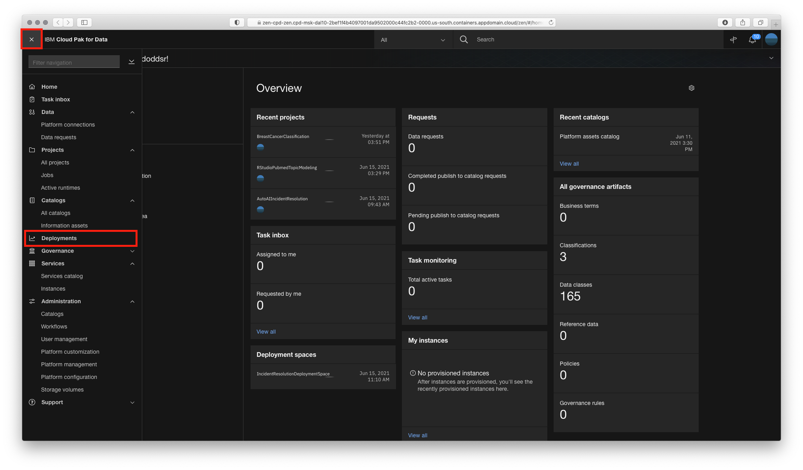
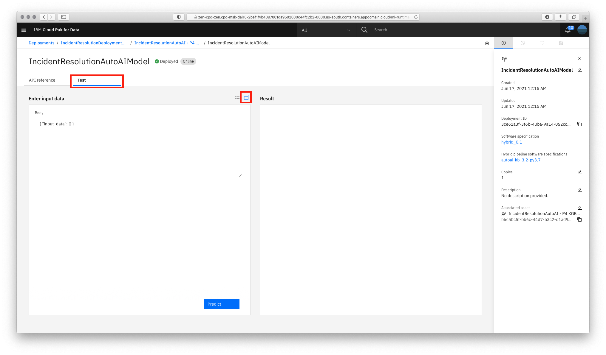
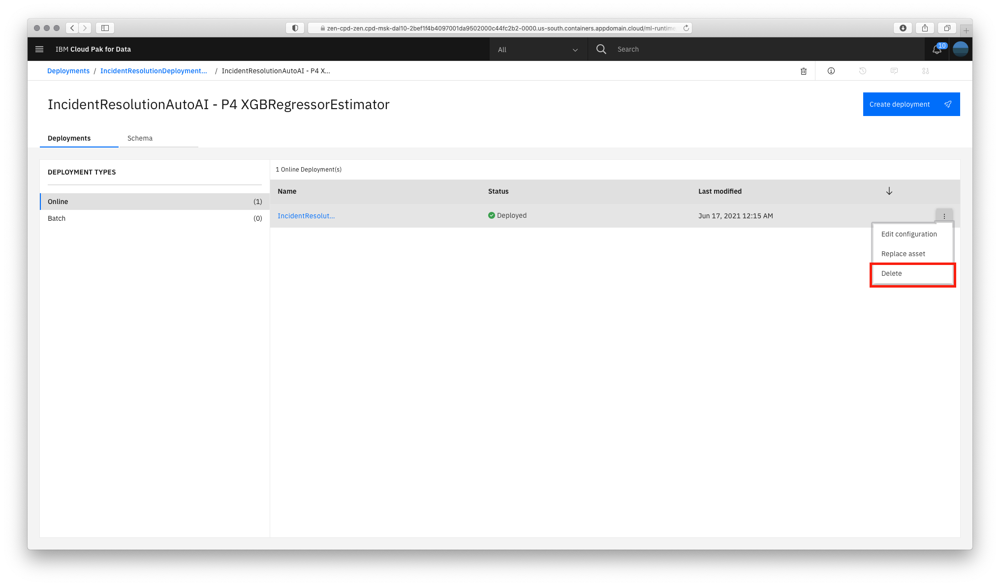

# Machine Learning Model Online Deployment and Scoring

In this module, we will learn how to deploy our Machine Learning models. By doing so, we make them available for use in production such that applications and business processes can derive insights from them. There are several types of deployments available ([depending on the model framework used](https://www.ibm.com/support/producthub/icpdata/docs/content/SSQNUZ_current/wsj/analyze-data/pm_service_supported_frameworks.html)). In this lab, we will explore:

* Online Deployments - Allows you to run the model on data in real-time, as data is received by a web service.

This lab will build an online deployment and test the model endpoint using both the built in testing tool as well as external testing tools.

> **Note:** You can click on any image in the instructions below to zoom in and see more details. When you do that just click on your browser's back button to return to the previous page.

## Create Online Model Deployment

After a model has been created, saved and promoted to our deployment space, we can proceed to deploying the model. For this section, we will be creating an online deployment. This type of deployment will make an instance of the model available to make predictions in real time via an API. Although we will use the Cloud Pak for Data UI to deploy the model, the same can be done programmatically.

* Navigate to the left-hand (☰) hamburger menu, click on the `Deployments` section.

    [](../images/navigation/menu-analytics-deployments.png)

* Click on the `Spaces` tab and then choose the deployment space you setup previously by clicking on the name of your space.

* From your deployment space overview, click the `Assets` tab and in the `Models` table, find the model name for the model you previously built and now want to create a deployment against. Use your mouse to hover over the right side of that table row and click the `Deploy` rocket icon (the icons are not visible by default until you hover over them).

    [](../images/deployment/deploy-autoai-model-icon.png)

* On the `Create a deployment` screen, choose `Online` for the `Deployment Type`, give the Deployment a name and optionally a description and click the `Create` button.

    [](../images/deployment/deploy-online-deployment.png)

* Click on the `Deployments` tab. The new deployment status will show as `In progress` and then switch to `Deployed` when it is complete.

    [](../images/deployment/deploy-status-deployed.png)

## Test Online Model Deployment

Cloud Pak for Data offers tools to quickly test out Watson Machine Learning models. We begin with the built-in tooling.

* From the Model deployment page, once the deployment status shows as `Deployed`, click on the name of your deployment. The deployment `API reference` tab shows how to use the model using `cURL`, `Java`, `Javascript`, `Python`, and `Scala`.

* To get to the built-in test tool, click on the `Test` tab and then click on the `Provide input data as JSON` icon.

    [](../images/deployment/deploy-model-test-page.png)

* Copy and paste the following data objects into the `Body` panel (replace the text that was in the input panel).

```json
{
    "input_data": [
        {
            "fields": [
                "number",
                "location",
                "u_floor",
                "u_room",
                "category",
                "subcategory",
                "business_service",
                "priority",
                "assignment_group",
                "taskslatable_sla",
                "taskslatable_stage",
                "inc_calendar_duration",
                "taskslatable_schedule",
                "taskslatable_start_time",
                "taskslatable_end_time"
            ],
            "values": [
                [
                    "",
                    "530 East 74th (Koch)",
                    "16th Floor",
                    "16-260",
                    "Hardware",
                    "Printer",
                    "",
                    "5 - Planning",
                    "",
                    "",
                    "",
                    "8-5 weekdays excluding holidays",
                    "",
                    ""
                ]
            ]
        }
    ]
}
```

* Click the *`Predict`* button. The model will be called with the input data and the results will display in the *Result* window. Scroll down to the bottom of the result to see the prediction.

    [](../images/deployment/deploy-test-model-prediction.png)

    > **Note:** For some deployed models (for example AutoAI based models), you can provide the request payload using a generated form by clicking on the `Provide input using form` icon and providing values for the input fields of the form. If the form is not available for the model you deployed, the icon will not be present or will remain grayed out.

    > [](../images/deployment/deploy-test-input-form.png)

* ***Important: If you have completed this section and do not plan on completing the other optional deployment approaches below, please go ahead and cleanup your deployment. Follow the [Cleanup Deployment instructions below.](#cleanup-deployments)***


## Cleanup Deployments

You can clean up the deployments created for your models. To remove the deployment:

* Navigate to the left-hand (☰) hamburger menu, expand the `Deployments` section and click on `View all spaces`.

    [](../images/navigation/menu-analytics-deployments.png)

* Choose the deployment space you setup previously by clicking on the name of your space.

* From your deployment space overview, click the `Assets` tab and in the 'Model' table, click on the model name that you previousely promoted and created deployments against.

* Under 'Deployment Types', click on `Online` to view the online deployments you have created for this model.

* In the table on the main panel, click on the three vertical dots at the right of the row for the online deployment you created. Select the `Delete` option from the menu.

    > *Note: The vertical dots are hidden until you hover over them with your mouse*

    [](../images/deployment/delete-deployment.png)

* In the subsequent pop up window, click on the `Delete` button to confirm you want to delete this deployment.

* You can follow the same process to delete other deployments as needed.

## Conclusion

Congratulations. You've completed this lab and seen how to create and test online deployments for your machine learning models.
