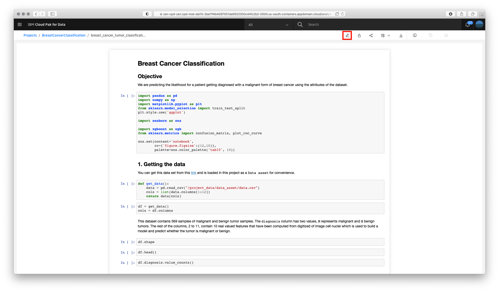
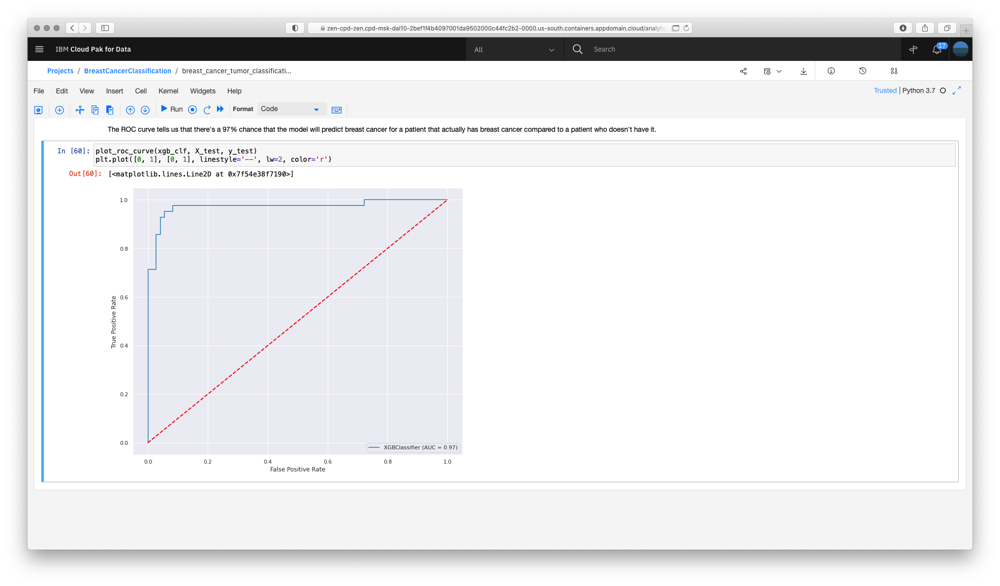

# Training a model for breast cancer classification using Watson Studio Jupyter notebooks

* Go the (☰) navigation menu, expand `Projects` and click on the `BreastCancerClassification` project pre-created for this section.

    

* Click on the notebook name `breast_cancer_tumor_classification` to open it.

    

* Let's interactively run the steps included in the notebook. To do so click on the edit button.

    

* Run step by step from 1. to 4. to get the data, visualize it, train the model and evaluate its performance.

    