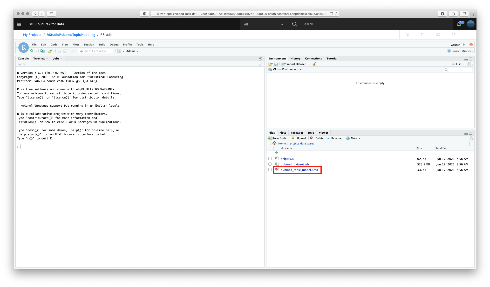

# Running RStudio

* Go the (☰) navigation menu, expand `Projects` and click on the `RStudioPubmedTopicModeling` project pre-created for this section.

    

* Open RStudio by clicking on `Launch IDE` and the `RStudio`.

    

* Select runtime `RStudio (2 vCPU and 2 GB RAM)` and click on `Launch` button.

    

* Once the RStudio is open, click on the `project_data_asset` directory and click again to open the notebook

    

    

* Sequentially from 1. to 6. run step by step clicking on the play button of each section
    
    1. **Load dependencies**
    1. **Fetch articles from Pubmed and persist dataset**. If this step fails you can still continue using the pre-loaded dataset.
    1. **Load and visualize articles dataset**
    1. **Prepare data**
    1. **Run LDA**. This can take a couple of minutes.
    1. **Generate visualization**

    

* After step 6. successfully completes, you will see a new directory `serVis` under your `Files` tab on the lower right side. Click on `serVis`, then click on the `index.html` file and select `View in Web Browser`.

    

    

* A new window will open on your default browser. Feel free to play with the visualization you just generated.
    
    